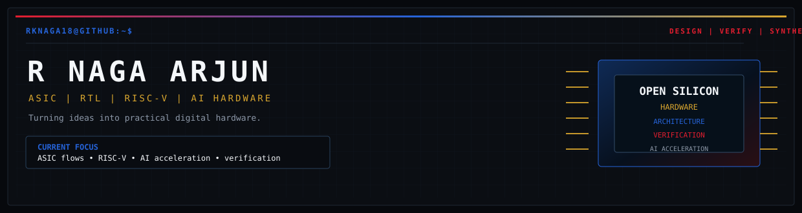
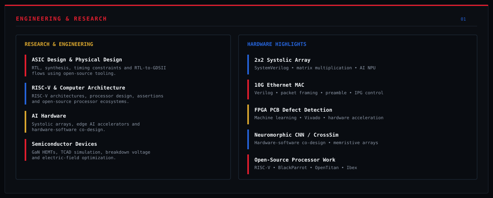
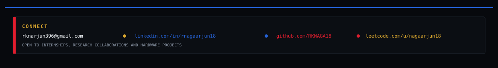

 

&nbsp;

&nbsp;

&nbsp;

  

  

About Me

I am an Electronics Engineering student at Vellore Institute of Technology, specializing in VLSI. My main interests are digital hardware design, ASIC development, computer architecture, RISC-V, and hardware acceleration for AI.

I enjoy working across the hardware stack, from RTL design and verification to synthesis, physical design, and FPGA prototyping. I am particularly interested in how algorithms and computer architectures can be translated into efficient hardware implementations.

My current focus is on building practical hardware projects, contributing to open-source silicon projects, and learning more about the complete path from RTL to physical hardware.

cat ~/workspace/profile/config.yaml

<table border="0" cellspacing="0" cellpadding="0" width="100%">
  <tr>
    <td width="55%">

<pre><strong>$ system_info --fetch</strong>

  <strong>FOCUS:</strong>      ASIC Design, RTL-to-GDSII Flow, AI Hardware
  <strong>LANGUAGES:</strong>  SystemVerilog, Verilog, C/C++, Python
  <strong>SCRIPTING:</strong>  TCL, Perl, Bash
  <strong>BUILDING:</strong>   <em>RISC-V Architecture & Edge AI Accelerators</em>
  <strong>HONORS:</strong>     <em>Samsung Fellowship (Grade II)</em>
  <strong>MAJOR:</strong>      <em>B.Tech Electronics Eng (VLSI) | CGPA: 8.84</em>
  <strong>COLLEGE:</strong>    <em>Vellore Institute of Technology</em>
</pre>

</td>
<td width="45%" align="center">
  
</td>

  </tr>
</table>

Contribution Activity

  <picture>
    <source media="(prefers-color-scheme: dark)" srcset="https://raw.githubusercontent.com/RKNAGA18/RKNAGA18/output/github-contribution-grid-snake-dark.svg">
    <source media="(prefers-color-scheme: light)" srcset="https://raw.githubusercontent.com/RKNAGA18/RKNAGA18/output/github-contribution-grid-snake.svg">
    
  </picture>

The contribution snake is generated automatically from the GitHub activity graph. The repository's snake workflow is configured to use the red, blue and gold palette.

Current Workflow & Tech Stack

<pre><strong>[root@R_NAGA_ARJUN ~]# ./display_workflow.sh</strong>
  ┌───────────────────────────────────────────────────────────────────────┐
  │                                                                       │
  │  [1] RTL DESIGN & ARCHITECTURE         [2] ASIC FLOW & AUTOMATION     │
  │      -> SystemVerilog, Verilog             -> RTL to GDSII Flow       │
  │      -> RISC-V Microarchitecture           -> TCL & Perl Scripting    │
  │      -> AI/ML Hardware Accelerators        -> Standard Cell Method.   │
  │                                                                       │
  │  [3] VERIFICATION & TEST               [4] ALGORITHMS & PROTOTYPING   │
  │      -> Verilator, DPI-C                   -> Python, C++, LeetCode   │
  │      -> Hardware Assertions                -> Data Structures & Logic │
  │                                                                       │
  └───────────────────────────────────────────────────────────────────────┘
</pre>

grep -r "Experience & Research" ./portfolio/

Featured Silicon & Hardware Projects

A curated overview of my custom IP cores, open-source processor contributions, and hardware-accelerated AI research.

Edge AI NPU & 2x2 Systolic Array

Tech Stack: SystemVerilog Computer Architecture Digital Logic

Architected and implemented a 2x2 Systolic Array core optimized for high-throughput matrix multiplication.

Designed specialized control logic and data-pipelining for an Edge AI Neural Processing Unit (NPU) focused on executing low-latency machine learning inference directly on custom hardware.

High-Speed Networking: 10G Ethernet MAC Core

Tech Stack: Verilog Protocol Logic High-Speed Networking

Engineered a high-throughput 10 Gigabit Ethernet Media Access Control (MAC) core supporting line-rate packet processing.

Developed robust control state machines to handle custom packet framing, preamble insertion, and strict Inter-Packet Gap (IPG) compliance for reliable data transfer.

RTL-to-GDSII Flow & Physical Design Automation

Tech Stack: OpenROAD TCL Perl SystemVerilog

Worked through the complete ASIC physical design flow from RTL synthesis to GDSII layout generation using the OpenROAD toolchain.

Developed custom automation scripts utilizing TCL and Perl to streamline hardware tool execution and standard cell methodology.

Built a library of parameterized hardware design blocks and verification testbenches during a 100-Days-of-SystemVerilog sprint.

Generative Audio DSP (SGMSE+) | Samsung Spatial Hackathon

Tech Stack: Python Score-Based Generative Models Hardware Optimization

Engineered a score-based generative model (SGMSE+) for far-field and near-field speech de-reverberation.

Built training data pipelines by convolving LibriSpeech and ARNI datasets with artificial Room Impulse Responses (RIRs).

Explored model-weight optimization for deployment on resource-constrained hardware.

Evaluated performance using SI-SDR and DNSMOS metrics.

Open-Source Processor Ecosystem Contributions

Tech Stack: RISC-V (RV64GC/RV32I) Hardware Assertions (SVA) Security Integration

BlackParrot: Analyzed and contributed hardware safety assertions to the Linux-capable, cache-coherent RV64GC multicore processor ecosystem.

OpenTitan & Ibex: Explored security-centric silicon design paradigms by reviewing and testing root-of-trust components based on the parameterized 32-bit RISC-V Ibex CPU.

650V GaN HEMT Reliability Optimization & Patent

Tech Stack: Synopsys TCAD Semiconductor Device Physics

Performed advanced 2D TCAD simulations to optimize breakdown voltage and electric-field profiles of 650V GaN-on-Si High Electron Mobility Transistors (HEMTs) targeting EV fast-charging applications.

Drafted an innovative patent application focusing on structural modifications using source-connected field plates to improve power efficiency.

Neuromorphic CNN Acceleration (CrossSim)

Tech Stack: CrossSim Hardware-Software Co-Design VLSI

Evaluated analog-intensive hardware implementations of Convolutional Neural Networks (CNNs) using the CrossSim modeling framework.

Researched hardware-software co-design methodologies for mapping deep learning models onto neuromorphic memristive arrays.

FPGA-Based PCB Defect Detection

Tech Stack: Machine Learning Xilinx Vivado FPGA Prototyping

Trained and deployed optimized hardware-level defect classification models for Printed Circuit Boards (PCBs).

Synthesized and mapped the ML inference logic onto a Xilinx FPGA board for real-time, hardware-accelerated visual inspection.

./stack --list

Hardware Design

Programming & Automation

Open-Source & Research Interests

I am interested in projects that connect hardware architecture with practical system implementation.

ASIC and RTL design

RISC-V processor architecture

Hardware verification and assertions

RTL-to-GDSII automation

AI and machine-learning accelerators

Edge AI hardware

Neuromorphic computing

FPGA prototyping

Semiconductor device optimization

Open-source silicon

git stats --all

  

  

sudo wisdom

  

